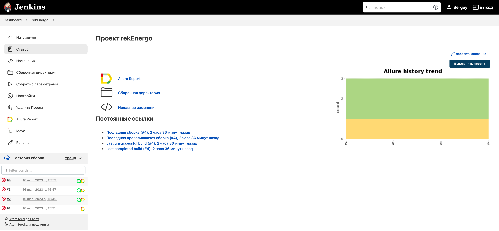
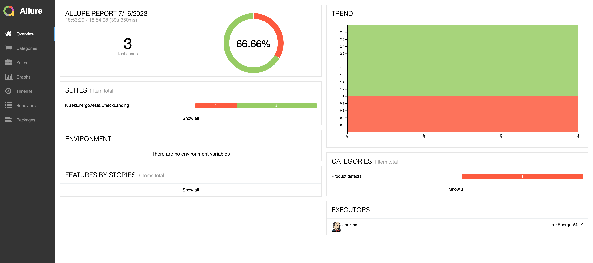
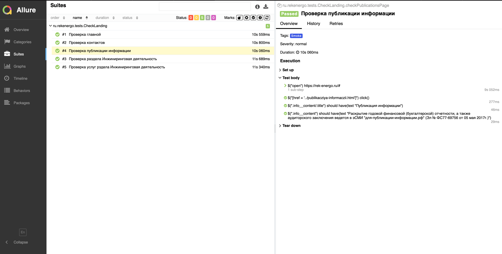
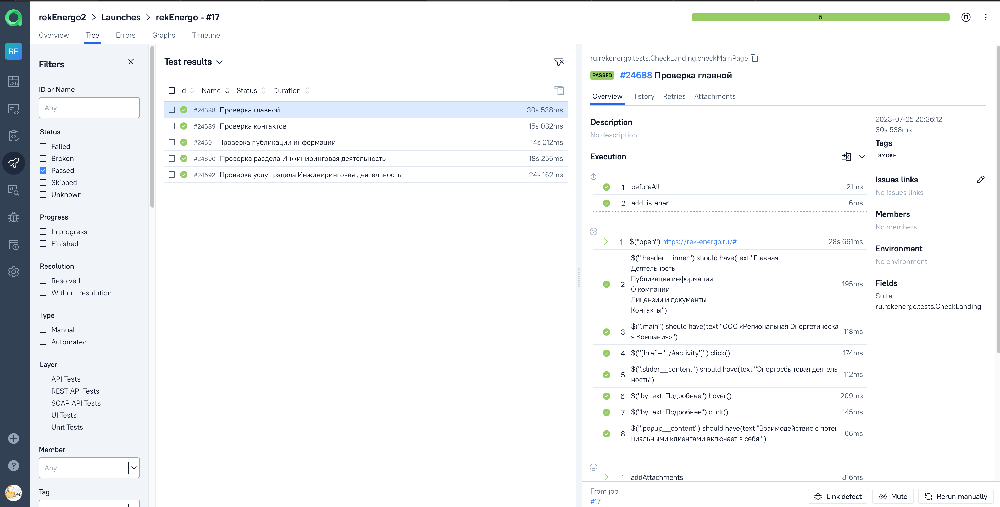
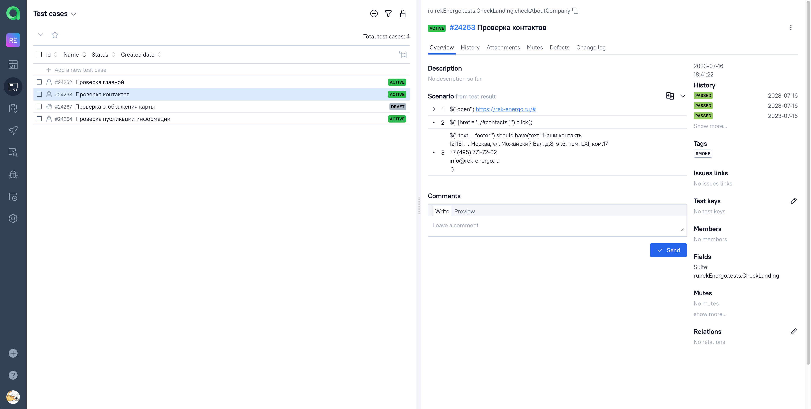
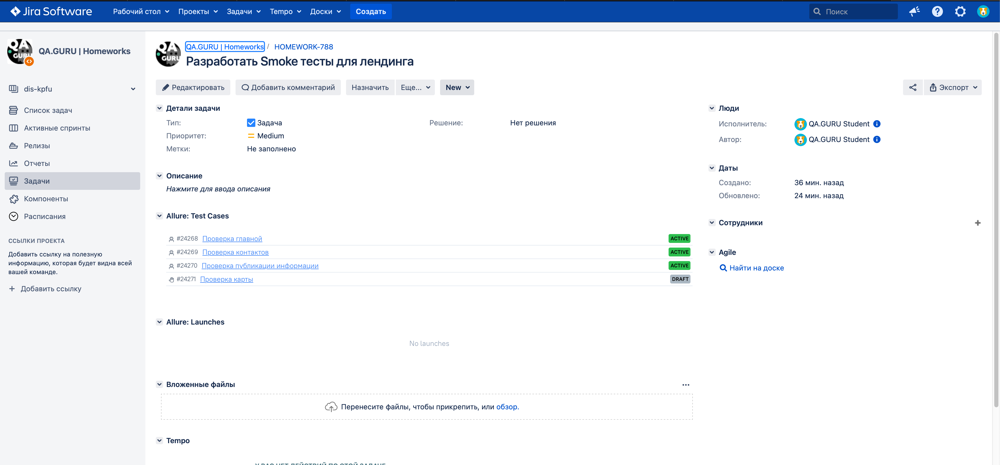
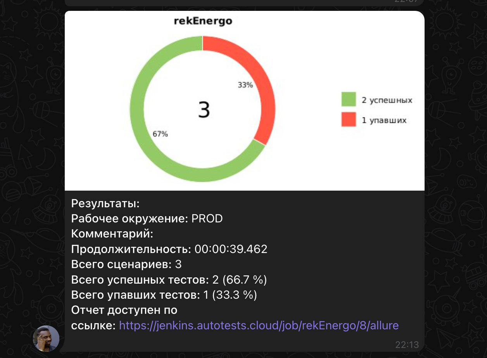
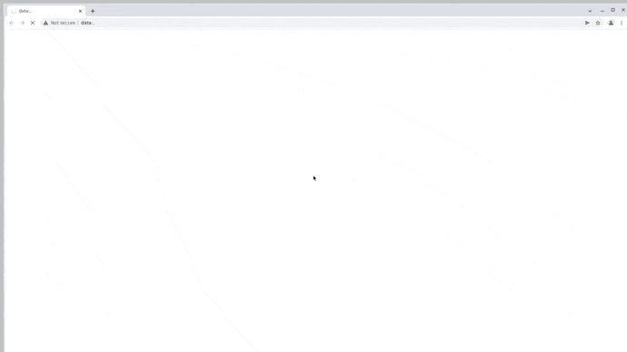

# ДемоПроект по автоматизации тестирования лендинга https://rek-energo.ru/

### Технологии и инструменты:
<p align="center">


</p>

### Реализованные проверки:
* Проверка открытия страницы
* Проверка хедера страницы
* Проверка заголовков страницы
* Проверка попапа с информацией
* Проверка страницы с опубликованной информацией
* Проверка отображения контактов компании

### Запуск тестов из терминала
#### Локальный запуск тестов:
```bash
gradle clean smoke_test
gradle clean test
```

#### Удаленный запуск тестов с параметрами:

```bash
clean
${TASK}
-DbaseUrl=${BASE_URL}
-DselenoidUrl=${SELENOID_URL}
-DbrowserSize=${BROWSER_SIZE}

```

### Сборка в Jenkins
<p align="center">

</p>

### Отчет в Allure report
#### Основная страница отчета
<p align="center">

</p>

#### Тест-кейсы
<p align="center">

</p>

### Интеграция с Allure TestOps
#### Dashboard
<p align="center">

</p>

#### Тест-кейсы
<p align="center">

</p>

### Интеграция с Jira
<p align="center">

</p>

### Уведомления в Telegram с использованием бота
<p align="center">

</p>

### Пример видео выполнения теста на Selenoid
<p align="center">
  
</p>
